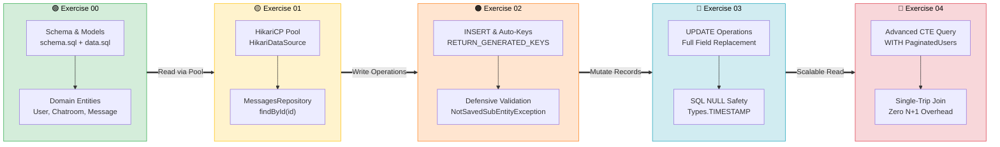
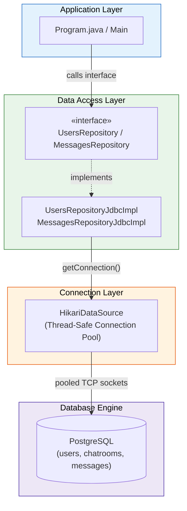
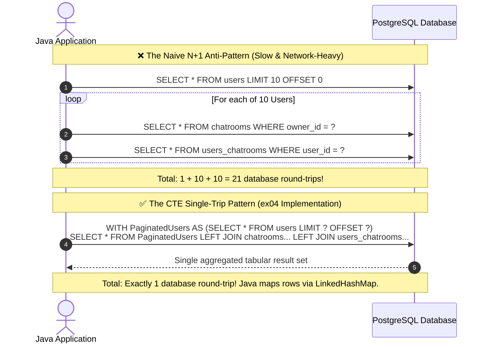
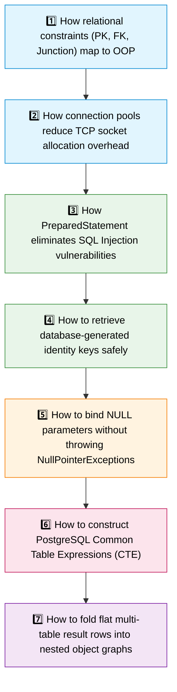

<div align="center">

# 🐘 Java Module 05 – SQL & JDBC

**Relational Database Modeling, Connection Pooling with HikariCP, DAO Pattern & Advanced CTE Pagination**


---

*From In-Memory Collections → Relational Persistence → High-Performance Data Access*

</div>

---

## 📖 Overview

Java Module 05 transitions from temporary in-memory Java state (`List`, `Map`, `Set`) to durable, enterprise-grade relational database persistence using **PostgreSQL** and the standard **Java Database Connectivity (JDBC)** API.

Through building the persistence tier for a real-time **Chat Application**, this module covers the full spectrum of data access engineering: relational schema design, the Object-Relational Impedance Mismatch, thread-safe connection pooling with **HikariCP**, defensive resource management with `try-with-resources`, and solving the notorious $N+1$ query problem using **PostgreSQL Common Table Expressions (CTE)**.

> [!IMPORTANT]
> Database connections are scarce OS resources bound to network sockets and DBMS worker threads. Writing leak-proof, parameterized, and pool-backed persistence code is the foundation of every production backend engineer's skillset.

---

## 🗺️ Module Progression



---

## 🧠 Core Architecture & Design Patterns

### 🏛️ Data Access Object (DAO) / Repository Pattern



---

### ⚡ The $N+1$ Query Problem vs CTE Solution (ex04)



---

## 📋 Concepts Breakdown by Exercise

| Capability / Concept | ex00 | ex01 | ex02 | ex03 | ex04 |
| :--- | :---: | :---: | :---: | :---: | :---: |
| DDL & DML Scripts (`schema.sql`, `data.sql`) | ✅ | ✅ | ✅ | ✅ | ✅ |
| Domain Models (`User`, `Chatroom`, `Message`) | ✅ | ✅ | ✅ | ✅ | ✅ |
| `HikariDataSource` Connection Pooling | | ✅ | ✅ | ✅ | ✅ |
| `PreparedStatement` Parameter Binding | | ✅ | ✅ | ✅ | ✅ |
| `ResultSet` to Domain Entity Mapping | | ✅ | ✅ | ✅ | ✅ |
| Generated Keys Retrieval (`RETURN_GENERATED_KEYS`) | | | ✅ | | |
| Custom Validation Exception (`NotSavedSubEntityException`) | | | ✅ | | |
| Handling SQL `NULL` with `Types.TIMESTAMP` | | | | ✅ | |
| PostgreSQL CTE (`WITH PaginatedUsers AS ...`) | | | | | ✅ |
| In-Memory Entity Aggregation (`LinkedHashMap`) | | | | | ✅ |

---

## 🎯 Exercises Overview

<table>
<tr>
<td width="20%" valign="top">

### 🟢 ex00
**Tables and Entities**

```text
schema.sql
    ↓
PostgreSQL Tables
    ↓
Java Domain Models
(equals/hashCode by ID)
```

**Key Files:**
- `schema.sql`
- `data.sql`
- `User.java`
- `Chatroom.java`
- `Message.java`

**Takeaway:**
> Relational foreign keys translate to Java object references and collections.

</td>
<td width="20%" valign="top">

### 🟡 ex01
**Read / Find**

```text
HikariDataSource
    ↓
Connection from Pool
    ↓
SELECT by ID
    ↓
Optional<Message>
```

**Key Files:**
- `MessagesRepository`
- `MessagesRepositoryJdbcImpl`
- `Program.java`

**Takeaway:**
> Always return `Optional<T>` for queries that can yield zero rows.

</td>
<td width="20%" valign="top">

### 🟠 ex02
**Create / Save**

```text
Validate Sub-Entities
    ↓ (Pass)
INSERT Statement
    ↓
Retrieve Generated ID
    ↓
entity.setId(newId)
```

**Key Files:**
- `save(Message)`
- `NotSavedSubEntityException`

**Takeaway:**
> Don't persist child records if author or room does not exist in DB.

</td>
<td width="20%" valign="top">

### 🔵 ex03
**Update**

```text
Existing Entity in DB
    ↓
update(Message)
    ↓
Handle NULL timestamp
    ↓
Database row mutated
```

**Key Files:**
- `update(Message)`
- `Types.TIMESTAMP`

**Takeaway:**
> Must set `ps.setNull()` explicitly when object fields are `null`.

</td>
<td width="20%" valign="top">

### 🔴 ex04
**Find All with CTE**

```text
WITH PaginatedUsers AS (
  SELECT * FROM users
  LIMIT ? OFFSET ?
)
LEFT JOIN rooms...
    ↓
LinkedHashMap Aggregation
```

**Key Files:**
- `findAll(page, size)`

**Takeaway:**
> Single CTE query eliminates the $N+1$ query performance trap.

</td>
</tr>
</table>

---

## 🔑 What You Should Learn and Understand



---

## 💡 Engineering Best Practices

> [!TIP]
> **Try-With-Resources Everywhere** — Always wrap `Connection`, `PreparedStatement`, and `ResultSet` in `try (...)` blocks. Omitting this causes socket leaks that will eventually lock the PostgreSQL server.

> [!TIP]
> **Never Concatenate Strings in SQL** — Always use `PreparedStatement` with `?` parameter placeholders. String concatenation like `"WHERE id = " + id` is an immediate security vulnerability.

> [!TIP]
> **HikariCP Sizing** — Never set pool size arbitrarily high. The optimal pool size follows the formula: `connections = ((core_count * 2) + effective_spindle_count)`.

---

## 📁 Module Directory Structure

```text
Module05/
├── 📄 .gitignore
├── 📄 README.md                               ← you are here
│
├── 🟢 ex00/
│   ├── 📄 README.md
│   └── Chat/
│       ├── pom.xml
│       └── src/main/
│           ├── java/fr/s42/chat/models/
│           │   ├── 👤 User.java
│           │   ├── 💬 Chatroom.java
│           │   └── ✉️ Message.java
│           └── resources/
│               ├── 📄 schema.sql
│               └── 📄 data.sql
│
├── 🟡 ex01/
│   ├── 📄 README.md
│   └── Chat/
│       ├── pom.xml
│       └── src/main/java/fr/s42/chat/
│           ├── 🚀 app/Program.java
│           ├── 📦 models/ (User, Chatroom, Message)
│           └── 🗄️ repositories/
│               ├── 📋 MessagesRepository.java
│               └── ⚙️ MessagesRepositoryJdbcImpl.java
│
├── 🟠 ex02/
│   ├── 📄 README.md
│   └── Chat/
│       ├── pom.xml
│       └── src/main/java/fr/s42/chat/
│           ├── 🚀 app/Program.java
│           ├── ⚠️ exceptions/NotSavedSubEntityException.java
│           ├── 📦 models/ (User, Chatroom, Message)
│           └── 🗄️ repositories/MessagesRepositoryJdbcImpl.java
│
├── 🔵 ex03/
│   ├── 📄 README.md
│   └── Chat/
│       ├── pom.xml
│       └── src/main/java/fr/s42/chat/
│           ├── 🚀 app/Program.java
│           ├── 📦 models/ (User, Chatroom, Message)
│           └── 🗄️ repositories/MessagesRepositoryJdbcImpl.java
│
└── 🔴 ex04/
    ├── 📄 README.md
    └── Chat/
        ├── pom.xml
        └── src/main/java/fr/s42/chat/
            ├── 🚀 app/Program.java
            ├── 📦 models/ (User, Chatroom, Message)
            └── 🗄️ repositories/
                ├── 📋 UsersRepository.java
                └── ⚙️ UsersRepositoryJdbcImpl.java
```

---

## 🚀 Quick Start

Ensure a local PostgreSQL instance is running on port `5432` with a database named `chat_db`:

```bash
# Initialize database schema and seed data
psql -U postgres -d chat_db -f Module05/ex00/Chat/src/main/resources/schema.sql
psql -U postgres -d chat_db -f Module05/ex00/Chat/src/main/resources/data.sql

# Exercise 01 (Find by ID)
cd Module05/ex01/Chat && mvn clean compile exec:java

# Exercise 02 (Save new Message)
cd Module05/ex02/Chat && mvn clean compile exec:java

# Exercise 03 (Update Message)
cd Module05/ex03/Chat && mvn clean compile exec:java

# Exercise 04 (CTE Paginated Find All)
cd Module05/ex04/Chat && mvn clean compile exec:java
```

---

<div align="center">

*Built as part of the 42 Java Curriculum*


</div>
