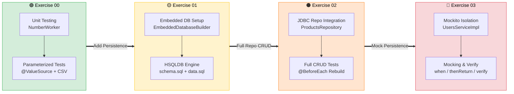
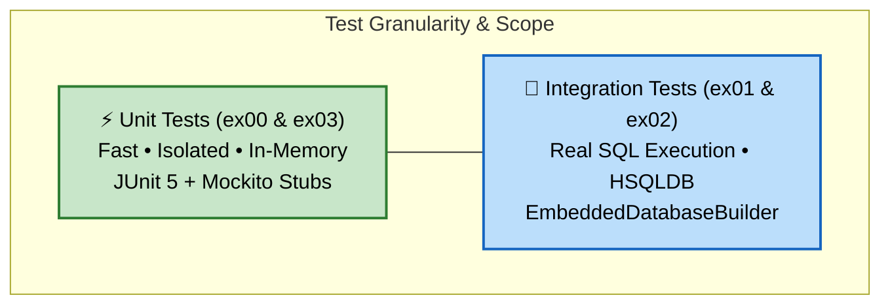
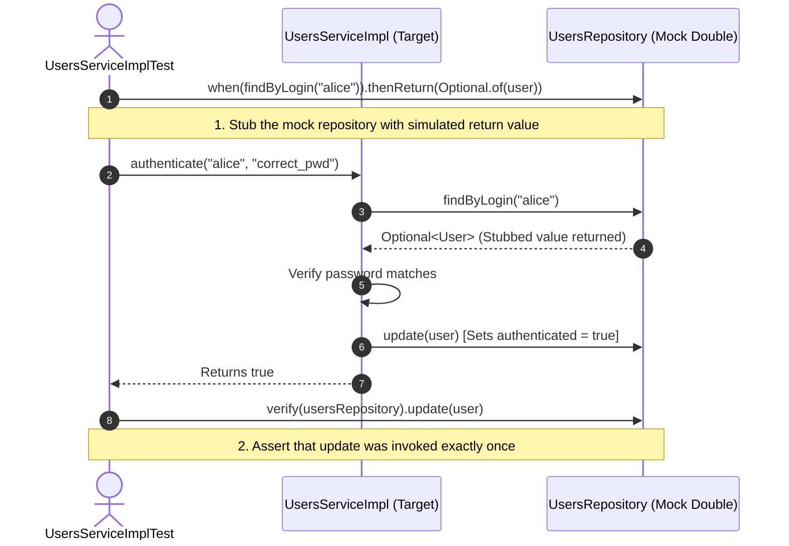
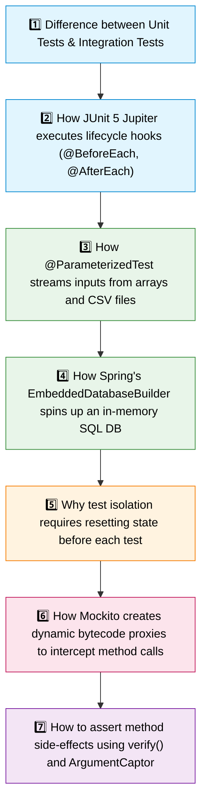

<div align="center">

# 🧪 Java Module 06 – JUnit 5 & Mockito

**Automated Testing, Test Pyramid, Parameterized Tests, In-Memory HSQLDB & Mocking Frameworks**


---

*From Unit Verification → Embedded Database Integration → Isolated Mocking*

</div>

---

## 📖 Overview

Java Module 06 introduces professional **software verification and automated testing** in Java. Writing implementation code is only half of software engineering; verifying that code is correct, regression-free, isolated, and resilient requires rigorous testing frameworks.

This module explores the full testing pyramid through modern industry standards:
- **Unit Testing (JUnit 5 Jupiter)**: Deterministic verification of core algorithms.
- **Parameterized & Data-Driven Tests**: High-coverage test suites driven by `@ValueSource` and CSV datasets via `@CsvFileSource`.
- **In-Memory Integration Testing**: Ephemeral embedded databases using **HSQLDB** and Spring's `EmbeddedDatabaseBuilder` to verify SQL persistence without external database servers.
- **Test Doubles & Mocking (Mockito)**: Decoupling business logic from data stores using `@Mock`, `@InjectMocks`, stubbing (`when(...).thenReturn(...)`), and interaction assertions (`verify(...)`).

> [!IMPORTANT]
> A well-architected test suite runs deterministically in any CI/CD pipeline without external environment dependencies. In-memory databases eliminate slow, fragile database networks, while mocking isolates faults to the exact class under test.

---

## 🗺️ Module Progression



---

## 🔺 The Testing Pyramid in Module 06



---

## 🎭 Mockito Stubbing & Verification Lifecycle (ex03)



---

## 📋 Concepts Breakdown by Exercise

| Testing Concept / Tool | ex00 | ex01 | ex02 | ex03 |
| :--- | :---: | :---: | :---: | :---: |
| `@Test` Basic Assertions (`assertEquals`, `assertTrue`) | ✅ | ✅ | ✅ | ✅ |
| Exception Verification (`assertThrows`) | ✅ | | | ✅ |
| Parameterized Tests (`@ParameterizedTest`) | ✅ | | | |
| Primitive Value Source (`@ValueSource`) | ✅ | | | |
| External Dataset Source (`@CsvFileSource`) | ✅ | | | |
| In-Memory DB Lifecycle (`EmbeddedDatabaseBuilder`) | | ✅ | ✅ | |
| Clean Database State per Test (`@BeforeEach`) | | ✅ | ✅ | |
| Full CRUD Persistence Verification | | | ✅ | |
| Mock Injection (`@Mock`, `@InjectMocks`, Mockito) | | | | ✅ |
| Stubbing Method Behavior (`when(...).thenReturn(...)`) | | | | ✅ |
| Interaction Verification (`verify(mock).method(...)`) | | | | ✅ |

---

## 🎯 Exercises Overview

<table>
<tr>
<td width="25%" valign="top">

### 🟢 ex00
**First Tests**

```text
NumberWorker
     ↓
@ParameterizedTest
  ├── @ValueSource (Primes)
  └── @CsvFileSource (DigitSum)
     ↓
assertThrows(IllegalNumber...)
```

**Key Deliverables:**
- `NumberWorker.java`
- `NumberWorkerTest.java`
- `data.csv`

**Takeaway:**
> Parameterized tests eliminate copy-pasting test methods for different input cases.

</td>
<td width="25%" valign="top">

### 🟡 ex01
**Embedded DataBase**

```text
schema.sql + data.sql
     ↓
EmbeddedDatabaseBuilder
     ↓ (Type.HSQL)
In-Memory DataSource
     ↓
getConnection() != null
```

**Key Deliverables:**
- `EmbeddedDataSourceTest`
- `schema.sql`
- `data.sql`

**Takeaway:**
> Embedded databases boot in milliseconds and require zero host DBMS installation.

</td>
<td width="25%" valign="top">

### 🟠 ex02
**Test for JDBC Repo**

```text
@BeforeEach (Rebuild DB)
     ↓
ProductsRepositoryJdbcImpl
  ├── findById()
  ├── update()
  ├── save() (assert ID)
  └── delete()
```

**Key Deliverables:**
- `ProductsRepositoryJdbcImpl`
- `ProductsReposutoryJdbcImplTest`
- Expected fixture constants

**Takeaway:**
> Every test must execute against a clean, freshly-seeded database state.

</td>
<td width="25%" valign="top">

### 🔴 ex03
**Test for Service**

```text
@Mock UsersRepository
     ↓
@InjectMocks UsersServiceImpl
     ↓
when(...).thenReturn(...)
     ↓
verify(repo).update(...)
```

**Key Deliverables:**
- `UsersServiceImpl.java`
- `UsersServiceImplTest.java`
- `AlreadyAuthenticatedException`

**Takeaway:**
> Never test business logic against real databases; mock external dependencies.

</td>
</tr>
</table>

---

## 🔑 What You Should Learn and Understand



---

## 💡 Engineering Best Practices

> [!TIP]
> **State Isolation with `@BeforeEach`** — In integration tests (`ex02`), always drop/recreate tables in `@BeforeEach`. If Test A mutates a row that Test B relies on, test execution order will cause intermittent failures (flaky tests).

> [!TIP]
> **Don't Mock What You Don't Own** — Mock your internal interfaces (`UsersRepository`), not third-party libraries or standard Java primitives (`String`, `List`).

> [!TIP]
> **Test Boundaries & Exceptions** — Testing happy paths is trivial. High-quality suites heavily test edge cases: negative numbers, non-existent entity IDs, null pointers, and duplicate credentials.

---

## 📁 Module Directory Structure

```text
Module06/
├── 📄 .gitignore
├── 📄 README.md                               ← you are here
│
├── 🟢 ex00/
│   ├── 📄 README.md
│   └── Tests/
│       ├── pom.xml
│       └── src/
│           ├── main/java/fr/s42/numbers/
│           │   ├── 🔢 NumberWorker.java
│           │   └── ⚠️ IllegalNumberException.java
│           └── test/
│               ├── java/fr/s42/numbers/
│               │   └── 🧪 NumberWorkerTest.java
│               └── resources/
│                   └── 📄 data.csv
│
├── 🟡 ex01/
│   ├── 📄 README.md
│   └── Tests/
│       ├── pom.xml
│       └── src/test/
│           ├── java/fr/s42/repositories/
│           │   └── 🧪 EmbeddedDataSourceTest.java
│           └── resources/
│               ├── 📄 schema.sql
│               └── 📄 data.sql
│
├── 🟠 ex02/
│   ├── 📄 README.md
│   └── Tests/
│       ├── pom.xml
│       └── src/
│           ├── main/java/fr/s42/
│           │   ├── 📦 models/Product.java
│           │   └── 🗄️ repositories/
│           │       ├── 📋 ProductsRepository.java
│           │       └── ⚙️ ProductsRepositoryJdbcImpl.java
│           └── test/java/fr/s42/repositories/
│               └── 🧪 ProductsReposutoryJdbcImplTest.java
│
└── 🔴 ex03/
    ├── 📄 README.md
    └── Tests/
        ├── pom.xml
        └── src/
            ├── main/java/fr/s42/
            │   ├── ⚠️ exceptions/ (AlreadyAuthenticatedException, EntityNotFoundException)
            │   ├── 👤 models/User.java
            │   ├── 🗄️ repositories/UsersRepository.java
            │   └── 🔨 services/
            │       ├── 📋 UsersService.java
            │       └── ⚙️ UsersServiceImpl.java
            └── test/java/fr/s42/services/
                └── 🧪 UsersServiceImplTest.java
```

---

## 🚀 Quick Start

Run the test suite across all four exercises using Maven:

```bash
# Exercise 00 (Parameterized NumberWorker tests)
cd Module06/ex00/Tests && mvn clean test

# Exercise 01 (In-memory HSQLDB datasource validation)
cd Module06/ex01/Tests && mvn clean test

# Exercise 02 (Full CRUD verification against HSQLDB)
cd Module06/ex02/Tests && mvn clean test

# Exercise 03 (Mockito service authentication verification)
cd Module06/ex03/Tests && mvn clean test
```

---

<div align="center">

*Built as part of the 42 Java Curriculum*


</div>
