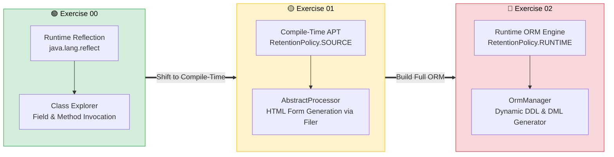
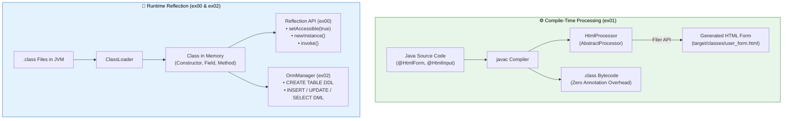
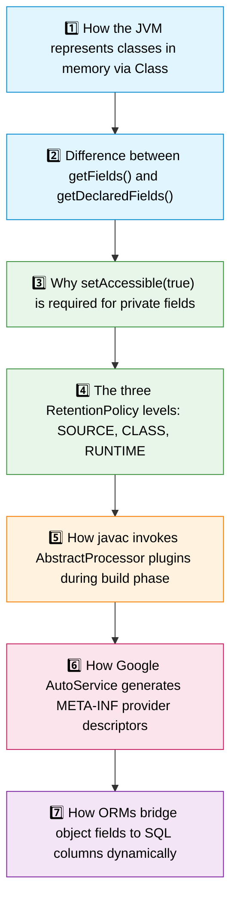

<div align="center">

# 🪞 Java Module 07 – Reflection & Annotations

**Metaprogramming, Runtime Reflection, Compile-Time Annotation Processors (APT) & Custom ORM Engines**


---

*From Dynamic Runtime Inspection → Compile-Time Code Generation → Custom ORM Architecture*

</div>

---

## 📖 Overview

Java Module 07 explores **metaprogramming** in Java through two foundational mechanisms: the **Java Reflection API** (`java.lang.reflect`) and **Java Annotations** (both compile-time processing via `javax.annotation.processing` and runtime reflection).

Nearly every major Java enterprise framework—such as **Spring Framework**, **Hibernate / JPA**, **Jackson**, and **JUnit**—relies on reflection and annotations to inspect classes dynamically, inject dependencies, map database schemas, and execute tests without hardcoding class dependencies. This module demystifies that "framework magic" by having you build three progressively sophisticated systems from scratch:

1. An interactive runtime class explorer and dynamic method invoker.
2. A compile-time annotation processor that generates HTML forms during `mvn compile`.
3. A lightweight Object-Relational Mapping (ORM) engine generating DDL and DML statements at runtime.

> [!IMPORTANT]
> Understanding the boundary between **compile-time** (`RetentionPolicy.SOURCE`) and **runtime** (`RetentionPolicy.RUNTIME`) is essential. Compile-time tools eliminate runtime overhead by generating artifacts during compilation, while runtime reflection allows dynamic behavior based on class metadata.

---

## 🗺️ Module Progression



---

## 🔬 Compile-Time vs Runtime Metaprogramming



---

## 🏛️ Mini ORM Engine Flow (ex02)

```mermaid
flowchart TD
    ENTITY["📦 Java Entity\nUser.java\n• @OrmEntity(table='simple_user')\n• @OrmColumnId (id)\n• @OrmColumn(name='first_name')"] --> MGR["⚙️ OrmManager"]

    MGR -->|"save(entity)"| DDL["DDL: DROP & CREATE TABLE simple_user (...)"]
    MGR -->|"save(entity)"| INSERT["DML: INSERT INTO simple_user (...) VALUES (...)"]
    MGR -->|"update(entity)"| UPDATE["DML: UPDATE simple_user SET ... WHERE id = ..."]
    MGR -->|"findById(id, Class)"| SELECT["DML: SELECT ... FROM simple_user WHERE id = ..."]

    style ENTITY fill:#fff3e0,stroke:#e65100,color:#000
    MGR fill:#e1f5fe,stroke:#0288d1,color:#000
    style DDL fill:#f1f8e9,stroke:#558b2f,color:#000
    style INSERT fill:#ede7f6,stroke:#512da8,color:#000
    style UPDATE fill:#e0f2f1,stroke:#00695c,color:#000
    style SELECT fill:#fce4ec,stroke:#ad1457,color:#000
```

---

## 📋 Concepts Breakdown by Exercise

| Concept / Technology | ex00 | ex01 | ex02 |
| :--- | :---: | :---: | :---: |
| `Class<?>`, `Field`, `Method` Introspection | ✅ | | ✅ |
| Suppressing Access Checks (`setAccessible(true)`) | ✅ | | ✅ |
| Dynamic Instantiation (`Constructor.newInstance()`) | ✅ | | |
| Dynamic Method Execution (`Method.invoke()`) | ✅ | | |
| Custom Annotations (`@interface`) | | ✅ | ✅ |
| Compile-Time Retention (`RetentionPolicy.SOURCE`) | | ✅ | |
| Runtime Retention (`RetentionPolicy.RUNTIME`) | | | ✅ |
| Annotation Processor (`AbstractProcessor`) | | ✅ | |
| Compiler SPI Hook (`@AutoService(Processor.class)`) | | ✅ | |
| Output Generation via `Filer` API | | ✅ | |
| Dynamic DDL Generation (`CREATE TABLE`) | | | ✅ |
| Dynamic DML Generation (`INSERT`, `UPDATE`, `SELECT`) | | | ✅ |

---

## 🎯 Exercises Overview

<table>
<tr>
<td width="33%" valign="top">

### 🟢 ex00
**Work with Classes**

```text
User / Car Input
      ↓
Class.forName(...)
      ↓
Print Fields & Methods
      ↓
newInstance() via Prompts
      ↓
Dynamic field.set(...)
      ↓
method.invoke(...)
```

**Key Deliverables:**
- `classes.User`
- `classes.Car`
- `app.Program`

**Takeaway:**
> Reflection allows inspecting and mutating private state at runtime.

</td>
<td width="33%" valign="top">

### 🟡 ex01
**Annotations - SOURCE**

```text
UserForm.java
  ├── @HtmlForm
  └── @HtmlInput
      ↓ (javac)
HtmlProcessor (APT)
      ↓ (Filer)
target/classes/user_form.html
(Zero runtime footprint)
```

**Key Deliverables:**
- `@HtmlForm`, `@HtmlInput`
- `HtmlProcessor`
- AutoService SPI descriptor

**Takeaway:**
> Compile-time processors generate files during compilation with zero runtime cost.

</td>
<td width="33%" valign="top">

### 🔴 ex02
**ORM Framework**

```text
User Entity
  ├── @OrmEntity
  ├── @OrmColumnId
  └── @OrmColumn
      ↓
OrmManager (Reflection)
      ↓
DDL: CREATE TABLE
DML: INSERT, UPDATE, SELECT
```

**Key Deliverables:**
- `@OrmEntity`, `@OrmColumn`, `@OrmColumnId`
- `models.User`
- `manager.OrmManager`

**Takeaway:**
> ORMs dynamically generate SQL by reading field and class metadata at runtime.

</td>
</tr>
</table>

---

## 🔑 What You Should Learn and Understand



---

## 💡 Engineering Best Practices

> [!TIP]
> **Use Reflection Sparingly** — Reflection bypasses compile-time type safety and is slower than direct invocations. Use it for frameworks, serialization, or plugin architectures, but avoid it in high-frequency business loops.

> [!TIP]
> **Choose the Right Retention Policy** — If an annotation is only used by a code generator or compiler linter, use `RetentionPolicy.SOURCE`. Keeping unused metadata in `.class` bytecode wastes memory.

> [!TIP]
> **Handle Primitives in Reflection** — Primitive types (`int`, `double`) are boxed into wrapper objects (`Integer`, `Double`) when accessed reflectively. If a method returns `void`, `method.invoke()` returns `null`.

---

## 📁 Module Directory Structure

```text
Module07/
├── 📄 .gitignore
├── 📄 README.md                               ← you are here
│
├── 🟢 ex00/
│   ├── 📄 README.md
│   └── Reflection/
│       ├── pom.xml
│       └── src/main/java/
│           ├── 🚀 app/Program.java
│           └── 📦 classes/
│               ├── 👤 User.java
│               └── 🚗 Car.java
│
├── 🟡 ex01/
│   ├── 📄 README.md
│   └── Annotations/
│       ├── pom.xml
│       └── src/main/java/
│           ├── 🏷️ annotations/
│           │   ├── 📄 HtmlForm.java
│           │   └── 📄 HtmlInput.java
│           ├── 📋 forms/UserForm.java
│           └── ⚙️ processor/HtmlProcessor.java
│
└── 🔴 ex02/
    ├── 📄 README.md
    └── ORM/
        ├── .gitignore
        ├── pom.xml
        └── src/main/java/
            ├── 🏷️ annotations/
            │   ├── 📄 OrmEntity.java
            │   ├── 📄 OrmColumn.java
            │   └── 📄 OrmColumnId.java
            ├── 🚀 app/Main.java
            ├── 📦 models/User.java
            └── ⚙️ manager/OrmManager.java
```

---

## 🚀 Quick Start

```bash
# Exercise 00 (Interactive Reflection CLI)
cd Module07/ex00/Reflection && mvn clean compile exec:java

# Exercise 01 (Compile-time HTML Form Generation)
cd Module07/ex01/Annotations && mvn clean compile
# Inspect generated HTML file:
cat target/classes/user_form.html

# Exercise 02 (Mini ORM SQL Generator)
cd Module07/ex02/ORM && mvn clean compile exec:java -Dexec.mainClass="app.Main"
```

---

<div align="center">

*Built as part of the 42 Java Curriculum*


</div>
