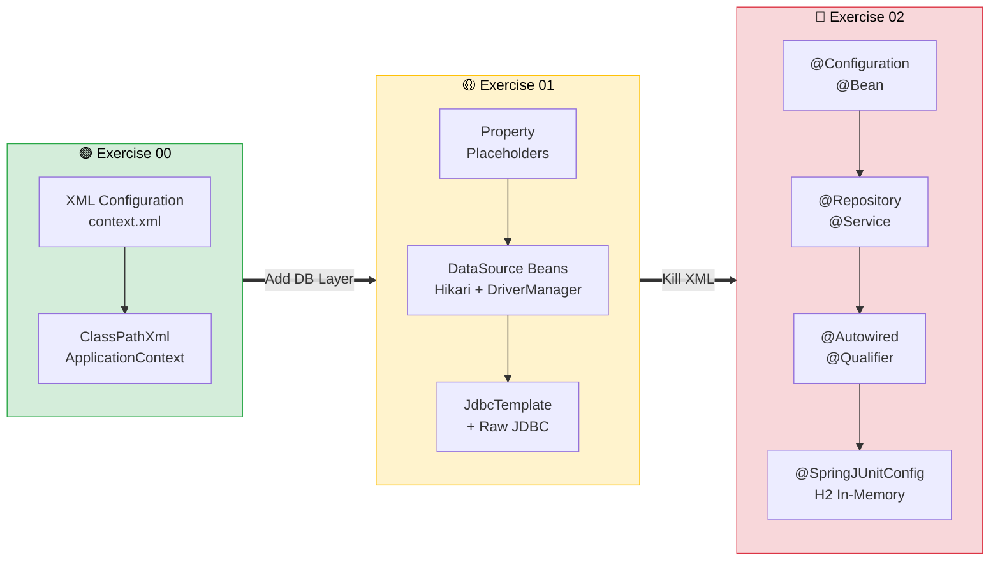
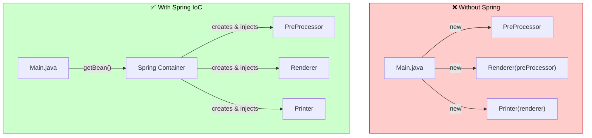
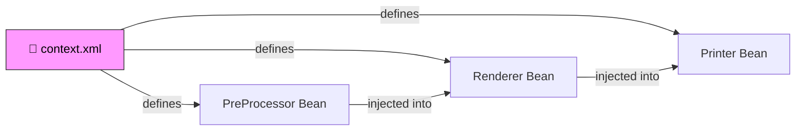
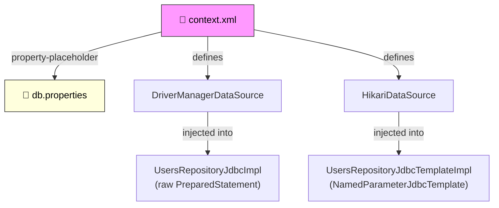
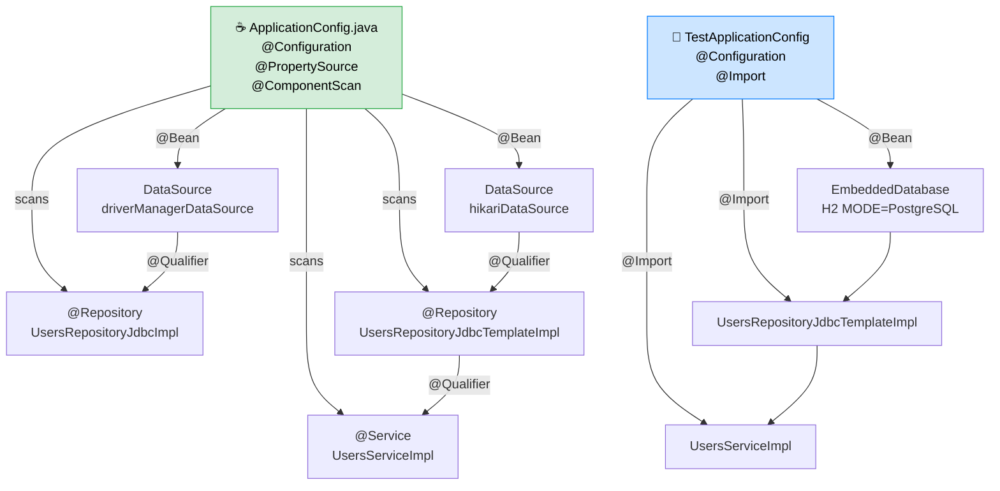
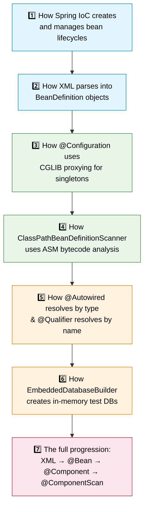

<div align="center">

# ☘️ Java Module 08 – Spring Framework

**Enterprise-level Java development with IoC, Dependency Injection & Annotation-based Configuration**


---

*From XML wiring → JdbcTemplate → Pure Annotation Config → Integration Testing*

</div>

---

## 📖 Overview

Module 08 introduces **enterprise-level Java development** using the **Spring Framework**. The module progressively builds understanding of Spring's **Inversion of Control (IoC)** container and **Dependency Injection (DI)** mechanisms — starting with XML-based configuration, advancing through database connectivity with `JdbcTemplate`, and culminating in a full migration to **annotation-based configuration** with integration testing.

> [!IMPORTANT]
> Spring Framework is the foundation of nearly all modern Java backend systems (Spring Boot, Spring Cloud, Spring Security). This module teaches how the IoC container manages object lifecycles, resolves dependencies, and decouples components — the same principles that power every production Spring application.

---

## 🗺️ Module Progression



---

## 🧠 Core Concepts Introduced

### 🔄 Inversion of Control & Dependency Injection



### 📋 Concepts by Exercise

| Concept | ex00 | ex01 | ex02 |
| :--- | :---: | :---: | :---: |
| IoC Container & Bean Lifecycle | ✅ | ✅ | ✅ |
| XML `<bean>` Configuration | ✅ | ✅ | ❌ |
| Constructor & Setter Injection | ✅ | ✅ | ✅ |
| `DataSource` (DriverManager + Hikari) | | ✅ | ✅ |
| Raw JDBC vs `JdbcTemplate` | | ✅ | ✅ |
| Property Placeholders (`db.properties`) | | ✅ | ✅ |
| `@Configuration` + `@Bean` | | | ✅ |
| `@Repository` / `@Service` Stereotypes | | | ✅ |
| `@ComponentScan` (ASM bytecode scanning) | | | ✅ |
| `@PropertySource` + `@Value` | | | ✅ |
| `@Autowired` + `@Qualifier` | | | ✅ |
| Integration Testing (H2 + JUnit 5) | | | ✅ |

---

## 🏗️ Architecture Evolution

### ex00 — XML Wiring


### ex01 — Database Layer Added


### ex02 — Pure Annotations (No XML)


---

## 🎯 Exercises Overview

<table>
<tr>
<td width="33%" valign="top">

### 🟢 ex00 — Spring Context
**XML-based IoC Configuration**

```text
PreProcessor
     ↓ (injected)
  Renderer
     ↓ (injected)
   Printer
     ↓
 "PREFIX HELLO"
```

**Key Files:**
- `context.xml`
- `Main.java`
- 6 interface/impl classes

**Key Takeaway:**
> Components declare *what* they need. The container decides *how* to wire them.

</td>
<td width="33%" valign="top">

### 🟡 ex01 — JdbcTemplate
**Database Connectivity via XML**

```text
db.properties
     ↓ (${db.url})
  context.xml
     ↓
 DataSource ×2
     ↓
Repository ×2
     ↓
  CRUD Ops
```

**Key Files:**
- `context.xml` + `db.properties`
- `UsersRepositoryJdbcImpl`
- `UsersRepositoryJdbcTemplateImpl`

**Key Takeaway:**
> JdbcTemplate eliminates ~15 lines of boilerplate per query.

</td>
<td width="33%" valign="top">

### 🔴 ex02 — AnnotationConfig
**Full Migration + Testing**

```text
 context.xml  →  🗑️ DELETED
       ↓
@Configuration
@ComponentScan
@Autowired
@Qualifier
       ↓
  @SpringJUnitConfig
  EmbeddedDatabase (H2)
```

**Key Files:**
- `ApplicationConfig.java`
- `TestApplicationConfig.java`
- `UsersServiceImplTest.java`

**Key Takeaway:**
> Zero XML. Annotations ARE the configuration.

</td>
</tr>
</table>

---

## 🔑 What You Should Learn and Understand



---

## 💡 Why These Concepts Matter

> [!TIP]
> **Loose Coupling** — IoC/DI eliminates hard-coded `new` calls. Components declare *what* they need, not *how* to get it — making code testable, maintainable, and swappable.

> [!TIP]
> **Configuration Evolution** — Understanding XML → annotations → component scanning explains *why* modern Spring Boot apps need almost zero configuration.

> [!TIP]
> **Database Best Practices** — `JdbcTemplate` prevents the most common JDBC bugs (unclosed connections, uncaught SQLExceptions). HikariCP provides production-grade connection pooling.

> [!TIP]
> **Testability** — In-memory databases + separate test configs enable fast, reliable integration tests with zero external infrastructure dependency.

---

## 📁 Module Directory Structure

```text
Module08/
├── 📄 Module08.subject.pdf
├── 📄 README.md                          ← you are here
│
├── 🟢 ex00/
│   ├── 📄 README.md
│   └── Spring/
│       ├── pom.xml
│       └── src/main/
│           ├── java/rabat/s1337/spring/
│           │   ├── 🚀 app/Main.java
│           │   ├── 🔧 preProcessor/ (PreProcessor, ToUpperImpl, ToLowerImpl)
│           │   ├── 🖨️ printer/ (Printer, WithDateTimeImpl, WithPrefixImpl)
│           │   └── 📺 render/ (Render, ErrImpl, StandardImpl)
│           └── resources/
│               └── 📄 context.xml
│
├── 🟡 ex01/
│   ├── 📄 README.md
│   └── Service/
│       ├── pom.xml
│       └── src/main/
│           ├── java/_42/spring/service/
│           │   ├── 🚀 application/Main.java
│           │   ├── 📦 models/User.java
│           │   └── 🗄️ repositories/ (CrudRepository, UsersRepository,
│           │       UsersRepositoryJdbcImpl, UsersRepositoryJdbcTemplateImpl)
│           └── resources/
│               ├── 📄 context.xml
│               ├── 📄 db.properties
│               ├── 📄 schema.sql
│               └── 📄 data.sql
│
└── 🔴 ex02/
    ├── 📄 README.md
    └── Service/
        ├── pom.xml
        └── src/
            ├── main/java/_42/spring/service/
            │   ├── 🚀 application/Main.java
            │   ├── ⚙️ config/ApplicationConfig.java
            │   ├── 📦 models/User.java
            │   ├── 🗄️ repositories/ (CrudRepository, UsersRepository,
            │   │   UsersRepositoryJdbcImpl, UsersRepositoryJdbcTemplateImpl)
            │   └── 🔨 services/ (UsersService, UsersServiceImpl)
            ├── main/resources/
            │   ├── 📄 db.properties
            │   ├── 📄 schema.sql
            │   └── 📄 data.sql
            └── test/java/_42/spring/service/
                ├── 🧪 config/TestApplicationConfig.java
                └── 🧪 services/UsersServiceImplTest.java
```

---

## 🚀 Quick Start

```bash
# Exercise 00
cd Module08/ex00/Spring && mvn clean compile exec:java

# Exercise 01 (requires running PostgreSQL)
cd Module08/ex01/Service && mvn clean compile exec:java

# Exercise 02 — Run app (requires running PostgreSQL)
cd Module08/ex02/Service && mvn clean compile exec:java

# Exercise 02 — Run tests (no external DB needed)
cd Module08/ex02/Service && mvn clean test
```

---

## 🧩 The XML → Annotation Migration at a Glance

| What changed | XML (`context.xml`) | Annotations |
| :--- | :--- | :--- |
| Configuration source | `<beans>` root element | `@Configuration` class |
| Bean definition | `<bean id="..." class="...">` | `@Bean` method or `@Component` / `@Repository` / `@Service` |
| Constructor injection | `<constructor-arg ref="..."/>` | `@Autowired` on constructor |
| Disambiguation | `ref="specificBean"` | `@Qualifier("specificBean")` |
| Property loading | `<context:property-placeholder>` | `@PropertySource` + `@Value` |
| Component scanning | `<context:component-scan>` | `@ComponentScan` |
| Context bootstrap | `ClassPathXmlApplicationContext` | `AnnotationConfigApplicationContext` |

---

<div align="center">

*Built as part of the 42 Java Curriculum*


</div>
